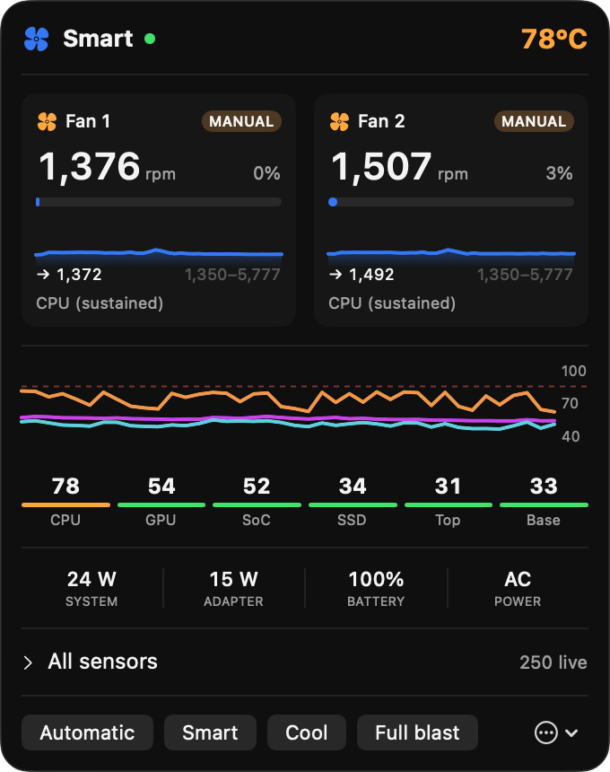
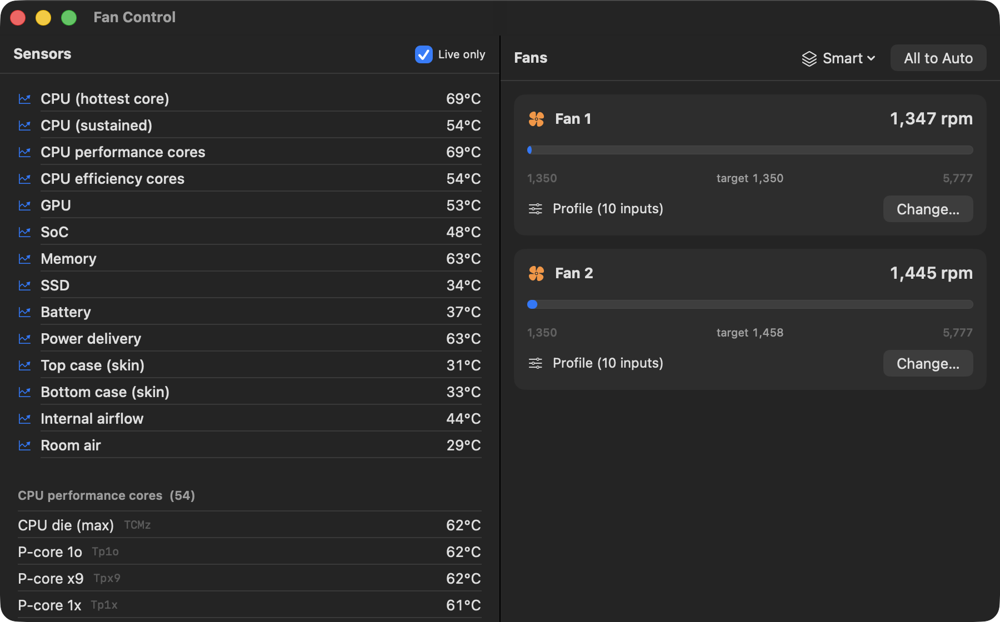

# Fan Control

A native macOS menu-bar app for reading every temperature sensor in your Mac and
taking control of its fans. Swift and SwiftUI, no dependencies, ~2,400 lines.

<p align="center">
  
</p>

Apple's firmware is conservative: on the machine this was built for it holds both
fans at their **minimum** while the CPU sits at **99 °C**, preferring to throttle
rather than spin. That is a reasonable default for silence, and a poor one if you
would rather your laptop stayed cool — or stayed cool *on your lap*.

## What it gives you

- **Live sensors.** ~300 of them, grouped by what they physically measure —
  CPU, GPU, SoC, memory, power delivery, SSD, battery, and the top and bottom
  case surfaces.
- **Two smart profiles.** `Smart` keeps the machine cool without being noisy.
  `Cool` keeps it cool, full stop.
- **Manual control.** Fix a fan at an RPM, or map any sensor onto a speed range.
- **Presets.** Save your own and switch from the menu bar.

## Install

**Download the installer** from [Releases](../../releases/latest) and open it.
It installs the app to `/Applications`, sets up the small privileged helper that
fan control requires, and launches the app.

> The package is not notarized (that needs a paid Apple Developer account), so
> macOS will warn you the first time. Right-click the `.pkg` and choose **Open**,
> or allow it under **System Settings → Privacy & Security**.

<details>
<summary>Or build from source</summary>

```bash
git clone https://github.com/ossama0808/Fan-Control.git
cd Fan-Control
./build.sh                 # builds, installs to /Applications, launches
sudo ./install-helper.sh   # once: installs the privileged fan helper
```

Needs Xcode command line tools. `./build.sh --no-install` builds without
touching the running app.
</details>

## Supported Macs

**Apple Silicon Macs that have fans**, on **macOS 14 (Sonoma) or later**:

| | |
|---|---|
| MacBook Pro 14" / 16" | M1/M2/M3/M4, all Pro and Max variants — 2 fans |
| MacBook Pro 13" | M1, M2 — 1 fan |
| Mac mini | M1, M2, M2 Pro, M4, M4 Pro — 1 fan |
| Mac Studio | M1/M2/M3/M4 Max and Ultra — 2 fans |
| Mac Pro | M2 Ultra — 3 fans |
| iMac 24" | M1, M3, M4 |

**MacBook Air has no fans**, so there is nothing for the app to control. It will
still show you every temperature sensor.

**Intel Macs are not supported.** The sensor classification and both profiles are
built around Apple Silicon's sensor layout and will not map correctly.

> Developed and verified on a MacBook Pro (Mac16,7, M4 Pro) running macOS 26.
> Other Apple Silicon Macs should work — the app reads the fan count and each
> fan's real RPM range from the hardware rather than assuming — but they are
> untested. If yours misbehaves, please open an issue with the model.

## Using it

### The menu bar

The status item shows a live temperature and fan speed. Click it for the panel
above: both fans with speed, duty and a two-minute sparkline; a thermal chart
with a throttle line; temperature chips; system and adapter power; and a rollup
of every live sensor. The buttons at the bottom switch profile instantly.

### Profiles

| | |
|---|---|
| **Automatic** | Hands the fans back to Apple's firmware. |
| **Smart** | Cool without being noisy. The everyday choice. |
| **Cool** | Cool, unconditionally. Audible on purpose. |
| **Full blast** | Every fan at maximum. |

What makes **Smart** smart is not a higher threshold but an *earlier, gentler*
one. Heat that is never allowed to accumulate never has to be removed in a hurry,
so a curve that starts early and rises slowly holds a lower steady temperature
than one that waits and then has to shout. Its ceiling is capped well below the
fan's range, and every input falls back to the fan's minimum, so it is silent
when the machine is idle and never becomes the loudest thing in the room.

**Cool** makes the opposite trade deliberately. Every input starts earlier and
rises harder, and it holds a raised floor on AC power even when everything is
cold. It also runs a *feed-forward* term on system power draw, because skin
temperature cannot be regulated reactively: the top case has roughly a 92-second
time constant and keeps climbing after the load that caused it has stopped.
Power draw leads skin temperature by about 40 seconds, so Cool starts spinning
before the case is warm rather than a minute after.

Both profiles watch CPU, SoC, GPU, memory, power delivery, SSD, battery and both
case surfaces, and run the fans at whichever input is closest to trouble — so a
sustained disk write or a charging battery raises the fans even with an idle CPU.
Those are cases a CPU-only curve is structurally blind to.

### The main window

<p align="center">
  
</p>

Every sensor, grouped, with computed aggregates at the top. On the right, each
fan with its live speed, target and hardware range. **Change…** opens per-fan
control: automatic, a fixed RPM, or a custom curve between any sensor and a speed
range, with a live preview of the resulting speed.

### Preferences

Fahrenheit, decimal places, poll rate, what the menu bar shows, launch at login,
and whether the app appears in the menu bar, the Dock, or both. It will not let
you hide both — that would leave it running and controlling your fans with no way
to reach it.

## A limitation worth knowing

When your Mac is cool, macOS does not idle the fans — it **switches them off
completely**. While they are off, no application can drive them. The SMC reports
fan mode `3`, refuses to accept a manual-mode write, and the flag that reports
the state is itself read-only. That is firmware behaviour, not something an app
can work around, and it applies equally to every fan utility.

So on a cool machine both profiles sit idle and the app says so plainly. The
firmware starts the fans on its own once the machine warms up, and control
resumes automatically from there. In practice this means Cool cannot hold its
raised floor on a genuinely cold machine — there is nothing to hold.

## Is this safe?

Short answer: yes, and it is hard to make it unsafe.

- **A profile can never cool less than Apple's firmware would.** The app records
  the firmware's own fan demand whenever a fan is on automatic and treats it as a
  hard lower bound on everything it commands.
- **A thermal backstop sits above every profile.** If any component exceeds its
  limit for five seconds straight, the fans go to maximum. No profile ever uses
  the top of the fan's range, so "fans at absolute maximum" is an unambiguous
  fault signal rather than a normal state.
- **Fans are released when the app exits** — on quit, and on signals, which
  AppKit does not handle for you. If the app is force-killed, the next launch
  detects fans still held in manual mode and releases them.
- **A dead sensor fails loud.** A curve whose sensor cannot be read commands
  maximum, never minimum.
- Nothing is overclocked and no limits are raised. The app only ever asks a fan
  to spin at a speed within the range the hardware itself reports.

## Security

Reading sensors needs no privilege. Writing a fan speed needs root, so that one
operation lives in a separate ~120 KB setuid helper. It accepts a fan index and
an RPM value and nothing else, clamped to that fan's own hardware limits read
back at write time — it cannot be used to write arbitrary SMC registers, even if
invoked directly.

The app is ad-hoc signed and not notarized. You can read every line of what runs
as root in [`Sources/smcwrite/main.swift`](Sources/smcwrite/main.swift) — it is
under 100 lines.

## How it works

The System Management Controller exposes a few thousand keys over an IOKit user
client. The app enumerates them, decodes the value types, and writes `F<n>Md` and
`F<n>Tg` to take a fan off automatic and hold a target speed.

Three findings shaped the design, all measured rather than assumed:

**Manual fan mode is a lease that expires.** Write a target once and the SMC hands
the fan back to firmware about two seconds later, silently, while your UI still
says "manual". Every managed fan is re-asserted twice a second. The lease is not
tied to the SMC connection — holding it open across the timeout changes nothing —
which is why no root daemon is needed.

**It does not reliably expire, either.** A fan commanded to maximum on a hot
machine has held manual mode for over twenty seconds with no process alive to
maintain it. Fans are released explicitly rather than left to lapse.

**Published sensor labels can be wrong.** `Ts0P`/`Ts1P` are widely documented as
SSD controller sensors. Under sustained writes that moved the real NAND sensor
+3.4 °C they moved +0.03 °C; under an all-core burn that moved the die +23.7 °C
they moved +0.37 °C. They are top-case skin sensors, and they are what the Cool
profile binds to.

## Development

```bash
swift build
swift run selftest          # curve maths, profile invariants, live hardware checks
swift run analyze all 180   # drive each profile through idle/load/recover
```

Quit the app first — it drives the same fans and two writers will fight.

`analyze` runs each profile through 25% idle, 50% all-core load and 25% recovery
and reports mean and peak fan speed, temperatures and which input was driving.
Idle numbers prove nothing about a fan curve, which is why the load phase exists.

### Releasing

```bash
./release.sh 1.1.0
```

Runs the checks, builds the installer, writes the notes into `CHANGELOG.md`,
tags, pushes, and publishes a GitHub release with the `.pkg` attached.

## License

MIT — see [LICENSE](LICENSE).
